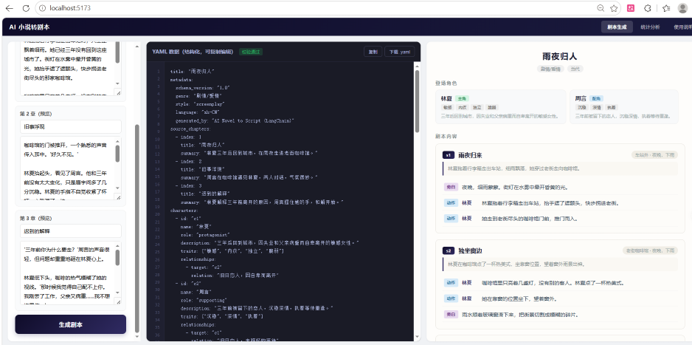
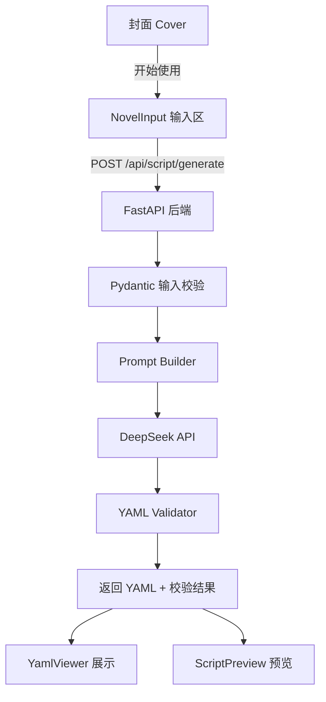

# AI 小说转剧本工具

> 将小说章节自动转换为结构化 YAML 格式剧本 —— 面向小说作者和内容创作者的 AI 辅助改编工具。



## 为什么做这个、

小说改编剧本通常需要人工逐章整理人物、场景、对白，耗时且易遗漏。本工具利用大模型完成情节拆解、角色提取、对白重组，输出结构化 YAML 剧本初稿，作者可直接在此基础上继续打磨。

## 技术亮点

- **零额外依赖调用大模型** — 用 Python 标准库 `urllib` 直连 DeepSeek API，不引入 openai/httpx 等第三方包
- **结构化 YAML Schema** — 自研 7 层嵌套剧本数据结构（title → characters → scenes → beats），覆盖旁白/对白/动作/独白/提示 5 种内容类型
- **双重校验链** — 前端 Pydantic 输入校验 + 后端 YAML 解析校验 + beats 类型枚举检查
- **角色一致性约束** — System Prompt 注入角色卡，确保跨场景角色名和性格统一
- **Prompt 工程** — 1700+ 字结构化系统提示词，约束模型输出纯 YAML（非 Markdown），含完整 Schema 示例

## 系统架构



## 项目结构

```text
ai-novel-to-script/
├── docs/
│   ├── prd.md              # 产品需求文档
│   ├── schema.md            # YAML Schema 设计
│   └── tech-design.md       # 技术设计文档
├── backend/
│   ├── app/
│   │   ├── main.py           # FastAPI 入口 + CORS
│   │   ├── logger.py         # 统一日志
│   │   ├── api/script.py     # /generate + /validate 路由
│   │   ├── models/           # Pydantic 请求/响应模型
│   │   └── services/         # 生成器 + 校验器 + prompt
│   ├── tests/                # 单元测试 (pytest, 11 cases)
│   ├── .env.example
│   └── requirements.txt
├── frontend/
│   ├── src/
│   │   ├── App.jsx           # 主页面 + 状态管理
│   │   ├── api.js            # Axios 后端调用
│   │   └── components/       # NovelInput / YamlViewer / ScriptPreview
│   ├── package.json
│   └── vite.config.js        # Vite + proxy 配置
├── prompts/
│   └── system_prompt.md      # 系统提示词文档
├── samples/
│   ├── sample_input.json     # 样例输入（3章小说）
│   └── sample_output.yaml    # 样例输出（完整YAML剧本）
└── README.md
```

## 开发状态

| 阶段 | 内容 | 状态 |
|---|---|---|
| P0 | FastAPI 骨架 + /health + 校验 | ✅ |
| P1 | DeepSeek API + Prompt + YAML生成 | ✅ |
| P2 | 前端三栏 + 预览 + 导出 | ✅ |
| 增强 | 日志 + 异常处理 + 单元测试 + UI美化 | ✅ |

## 前置依赖

- Python 3.9+
- Node.js 18+
- DeepSeek API Key

## 快速启动

```bash
# 后端
cd backend
python -m venv .venv
.venv\Scripts\activate        # Windows
pip install -r requirements.txt
cp .env.example .env          # 编辑 .env 填入 LLM_API_KEY
uvicorn app.main:app --reload

# 前端
cd frontend
npm install
npm run dev
```

浏览器打开 `http://localhost:5173`

## 运行测试

```bash
cd backend
.venv\Scripts\activate
python -m pytest tests/ -v
```

## API 接口

| 方法 | 路径 | 说明 |
|---|---|---|
| GET | `/health` | 健康检查 |
| POST | `/api/script/generate` | 生成剧本（需 3 章以上） |
| POST | `/api/script/validate` | 校验 YAML 文本 |
| GET | `/docs` | Swagger 文档 |

### 请求示例

```json
POST /api/script/generate
{
  "title": "小说标题",
  "chapters": [
    {"index": 1, "title": "第一章", "content": "..."},
    {"index": 2, "title": "第二章", "content": "..."},
    {"index": 3, "title": "第三章", "content": "..."}
  ],
  "style": "screenplay"
}
```

详见 `samples/sample_input.json` 和 `samples/sample_output.yaml`。
